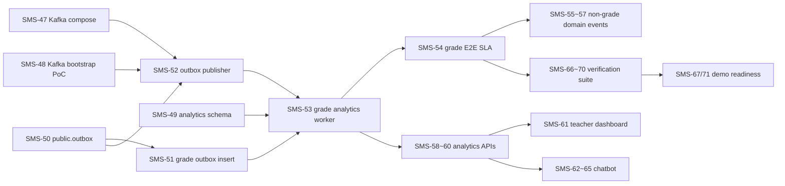

# Student Manager v2.1 Task Map

**작성일**: 2026-05-04  
**기준 문서**: `docs/architecture.md` v1.1, `docs/design-spec.md` v2.1  
**Jira 기준**: SMS 프로젝트, Board 2, active sprint 72 `Sprint 1 — 파이프라인 종단 (Grade)`  

> Jira MCP Rovo 검색은 현재 403(`app is not installed on this instance`)으로 실패했다. 동일 Jira credentials를 사용한 Jira REST 조회로 이슈/스프린트 상태를 확인했다.

## 1. Sprint Snapshot

### Active Sprint

| Sprint | 기간 | 목표 |
|---|---:|---|
| Sprint 1 — 파이프라인 종단 (Grade) | 2026-05-05 ~ 2026-05-19 | Outbox + Kafka + analytics 스키마 구축, Grade 도메인 종단 1개 + E2E SLA 검증 |

### Current Sprint Issues

| Jira | 상태 | Parent | 작업 | 관리 포인트 |
|---|---|---|---|---|
| SMS-47 | 완료 | SMS-72 | docker-compose Kafka KRaft 단일 노드 + health check | Sprint 기반 완료 |
| SMS-48 | 완료 | SMS-72 | Kafka bootstrap 검증 + Redpanda fallback 결정 게이트 | Sprint 기반 완료 |
| SMS-49 | 완료 | SMS-72 | Alembic analytics 스키마 + 5개 테이블 생성 | Sprint 기반 완료 |
| SMS-50 | 진행 중 | SMS-72 | Alembic public.outbox 테이블 + 부분 인덱스 | 다음 완료 후보 |
| SMS-51 | 해야 할 일 | SMS-72 | Grade UPSERT 라우터에 outbox INSERT + 단위 테스트 | SMS-50 이후 시작 |
| SMS-52 | 해야 할 일 | SMS-72 | outbox-publisher worker | SMS-50 이후 시작 가능 |
| SMS-53 | 해야 할 일 | SMS-72 | analytics-worker grade_events consumer | SMS-49, SMS-52 이후 통합 |
| SMS-54 | 해야 할 일 | SMS-76 | testcontainers E2E: PUT /grades -> analytics <= 1분 | SMS-51~53 이후 검증 |

## 2. Workstream Map



## 3. Epic Breakdown

### SMS-72: Pipeline Foundation

**문서 근거**: Architecture §3, §4.1, §4.4, §5.1, §9.1; Design Spec §1, §9.1~9.4  
**목표**: 운영 트랜잭션과 같은 TX에서 outbox row를 남기고, Kafka를 통해 analytics worker가 grade aggregate를 갱신하는 첫 종단 파이프라인을 완성한다.

| Jira | Deliverable | 선행조건 | 완료 기준 |
|---|---|---|---|
| SMS-50 | `public.outbox` migration + `sent_at IS NULL` 부분 인덱스 | SMS-49 | Alembic upgrade/downgrade, index 확인 |
| SMS-51 | Grade 생성/수정 같은 TX 안에서 outbox INSERT | SMS-50 | 도메인 row commit 시 outbox row도 commit, 실패 시 둘 다 rollback |
| SMS-52 | `outbox-publisher` polling + Kafka produce + sent_at mark | SMS-47, SMS-48, SMS-50 | broker 복구 후 unsent row catch-up |
| SMS-53 | `grade_events` consumer + fact/agg UPSERT | SMS-49, SMS-51, SMS-52 | `analytics.fact_grade_event`, `agg_student_subject`, `agg_student_overall` 갱신 |

**주의 계약**

- `public.outbox` INSERT는 운영 도메인 변경과 같은 transaction이어야 한다.
- 운영 API p95 영향 목표는 outbox INSERT 추가로 5ms 이하.
- `analytics.agg_*`는 UPSERT, 이벤트 중복은 idempotency 테스트로 보호한다.
- 새 business error는 `AppException`과 `{ detail, code }` 계약을 따른다.

### SMS-73: Domain Event Expansion

**문서 근거**: Architecture §4.4; Design Spec §9.2~9.4  
**목표**: Grade로 검증된 패턴을 Attendance, Feedback, Counseling으로 확장한다.

| Jira | Deliverable | 선행조건 | 완료 기준 |
|---|---|---|---|
| SMS-55 | Attendance outbox INSERT + analytics handler | SMS-53 | `attendance_events` fact/overall present rate 반영 |
| SMS-56 | Feedback outbox INSERT + analytics handler | SMS-53 | `feedback_events`가 `feedback_count` 집계 반영 |
| SMS-57 | Counseling outbox INSERT + analytics handler | SMS-53 | counseling 이벤트 처리 경로와 dead letter 정책 확인 |

**관리 규칙**

- Grade 파이프라인이 안정화되기 전에는 확장 작업을 시작하지 않는다.
- 각 도메인은 기존 side effect(Notification)와 outbox INSERT 순서/transaction 경계를 따로 테스트한다.

### SMS-74: Analytics API & Teacher Dashboard

**문서 근거**: Architecture §4.2; Design Spec §9.5  
**목표**: 무거운 운영 쿼리 대신 analytics aggregate table을 읽는 교사 분석 API와 대시보드를 제공한다.

| Jira | Deliverable | 선행조건 | 완료 기준 |
|---|---|---|---|
| SMS-58 | `/api/v1/analytics/students/{id}/overview` + RBAC | SMS-53 | 담당 교사만 조회, 타 학교/담당 외 데이터 차단 |
| SMS-59 | `/api/v1/analytics/classes/{id}/distribution` | SMS-53 | class teacher scope, 분포 응답 contract |
| SMS-60 | `/api/v1/analytics/teachers/me/dashboard` | SMS-53 | 담당 학급 요약 위젯 데이터 |
| SMS-61 | Frontend teacher dashboard widgets | SMS-58~60 | Recharts 기반, API 오류/빈 데이터 상태 포함 |

**주의 계약**

- 분석 API는 `analytics.agg_*`를 직접 조회하고 무거운 runtime aggregate를 피한다.
- RBAC는 JWT role 확인 + `school_id` + 담당 class scope를 모두 통과해야 한다.

### SMS-75: Chatbot

**문서 근거**: Architecture §4.3; Design Spec §10.1~10.5  
**목표**: 별도 서비스 없이 FastAPI 단일 라우터로 데모용 분석 데이터 기반 LLM 응답을 제공한다.

| Jira | Deliverable | 선행조건 | 완료 기준 |
|---|---|---|---|
| SMS-62 | `mask_context()` sanitizer + k>=5 guard | SMS-58~60 권장 | 학생명/번호/UUID/연락처 제거 단위 테스트 |
| SMS-63 | `POST /api/v1/chat` + provider SDK 직접 호출 | SMS-62 | teacher only, thread/reply/referenced_students contract |
| SMS-64 | Chat rate limit 10회/분 per user | SMS-63 | 초과 시 `{ detail, code }` 형태로 차단 |
| SMS-65 | Frontend chat widget + response mapping | SMS-63 | 참조 학생 링크/빈 응답/오류 상태 |

**주의 계약**

- 공식 명칭은 정식 RAG가 아니라 "분석 데이터 기반 LLM 자연어 응답"이다.
- `k<5` 또는 단일 학생 식별 가능 질의는 거부한다.
- LLM context에는 마스킹된 token만 전달한다.

### SMS-76: Verification

**문서 근거**: Architecture §6.2; Design Spec §9.6, §10.5  
**목표**: 확장성/정합성/보안 주장을 테스트로 증명한다.

| Jira | Deliverable | 선행조건 | 완료 기준 |
|---|---|---|---|
| SMS-54 | Grade E2E integration test | SMS-51~53 | PUT /grades -> analytics 반영 <= 1분 |
| SMS-66 | Idempotent UPSERT integration test | SMS-53 | 중복 메시지 처리 시 aggregate 중복/오염 없음 |
| SMS-68 | Playwright SLA E2E | SMS-54, SMS-60, SMS-61 | UI 기준 운영 변경 후 분석 반영 확인 |
| SMS-69 | Playwright analytics dashboard RBAC | SMS-58~61 | teacher/student/parent 권한 경계 |
| SMS-70 | Playwright chatbot PII block | SMS-62~65 | `k<5` 차단 및 마스킹 확인 |

**검증 게이트**

- Backend: ruff, pytest, coverage 80% 이상.
- Frontend: typecheck, focused Playwright.
- Demo: 운영 변경 -> analytics <= 1분, `analytics-worker=3` scale 시연.

### SMS-77: Demo Readiness

**문서 근거**: Architecture §5.1, §8; Design Spec §1, §9.6  
**목표**: 졸업 평가용 로컬 demo 환경을 반복 가능하게 만든다.

| Jira | Deliverable | 선행조건 | 완료 기준 |
|---|---|---|---|
| SMS-67 | `docker-compose --scale analytics-worker=3` demo + Makefile | SMS-53, SMS-66 | 메시지 분산과 consumer group 로그 확인 |
| SMS-71 | `demo_seed.py`, `docker-compose.demo.yml`, 발표 리허설 | SMS-61, SMS-65, SMS-67~70 | login -> grade input -> analytics/dashboard/chat demo path |

## 4. Recommended Execution Order

1. Finish SMS-50 and verify migration shape.
2. Implement SMS-51 with a failing unit test first: grade mutation commits outbox row in the same transaction.
3. Implement SMS-52 independently after SMS-50: publisher can be tested against unsent rows before analytics worker is complete.
4. Implement SMS-53 and run a local grade event through fact + aggregate UPSERT.
5. Close Sprint 1 with SMS-54: PUT /grades -> Kafka -> analytics <= 1분.
6. Expand to SMS-55~57 only after Grade path is stable.
7. Build analytics APIs SMS-58~60, then frontend dashboard SMS-61.
8. Build chatbot SMS-62~65 on top of analytics APIs and sanitizer guardrails.
9. Complete verification SMS-66, SMS-68~70.
10. Prepare demo SMS-67, SMS-71.

## 5. Management Views

### Ready Now

| Jira | 왜 지금 가능한가 |
|---|---|
| SMS-50 | analytics schema와 Kafka compose가 완료되어 outbox migration만 남음 |
| SMS-52 | SMS-50 완료 직후 publisher는 domain router와 병렬로 구현 가능 |

### Blocked

| Jira | Blocker |
|---|---|
| SMS-51 | SMS-50 outbox table 필요 |
| SMS-53 | SMS-51 grade event payload와 SMS-52 publisher 필요 |
| SMS-54 | SMS-51~53 종단 경로 필요 |
| SMS-55~57 | SMS-53 패턴 안정화 필요 |
| SMS-58~61 | aggregate table에 신뢰 가능한 데이터 필요 |
| SMS-62~65 | analytics query surface가 있어야 안전한 context 구성 가능 |
| SMS-66~71 | 대상 기능 구현 후 검증/데모 가능 |

### Suggested Jira Filters

```text
project = SMS AND Sprint in openSprints() ORDER BY Rank ASC
project = SMS AND statusCategory != Done ORDER BY Rank ASC
project = SMS AND parent = SMS-72 ORDER BY Rank ASC
project = SMS AND parent in (SMS-73, SMS-74, SMS-75, SMS-76, SMS-77) ORDER BY Rank ASC
```

## 6. Definition of Done

각 Jira 이슈는 다음을 만족할 때 완료로 전환한다.

- 설계 문서의 해당 API/data/flow contract를 충족한다.
- business error는 `AppException`과 `{ detail, code }` 형식만 사용한다.
- role + `school_id` + row scope 테스트가 필요한 경로에는 회귀 테스트가 있다.
- 변경 범위에 맞는 pytest/typecheck/Playwright 중 필요한 검증을 실행했다.
- 이슈 코멘트에는 변경 파일, 검증 명령, 남은 위험을 남긴다.
- 완료 즉시 Jira status를 `완료`(transition 31)로 전환한다.

## 7. Open Management Risks

| Risk | 영향 | 대응 |
|---|---|---|
| R-008 school_id 필터 누락 | 매우 높음 | analytics API와 도메인 event producer 모두 scope test 필수 |
| Kafka 단일 broker 장애 | 중간 | outbox catch-up test로 이벤트 유실 없음 증명 |
| idempotency 미흡 | 높음 | SMS-66을 Grade path 직후 배치 |
| Chatbot PII leakage | 높음 | SMS-62 sanitizer를 SMS-63보다 먼저 완료 |
| Demo 환경 재현성 | 중간 | SMS-71에서 seed + compose demo를 고정 |

