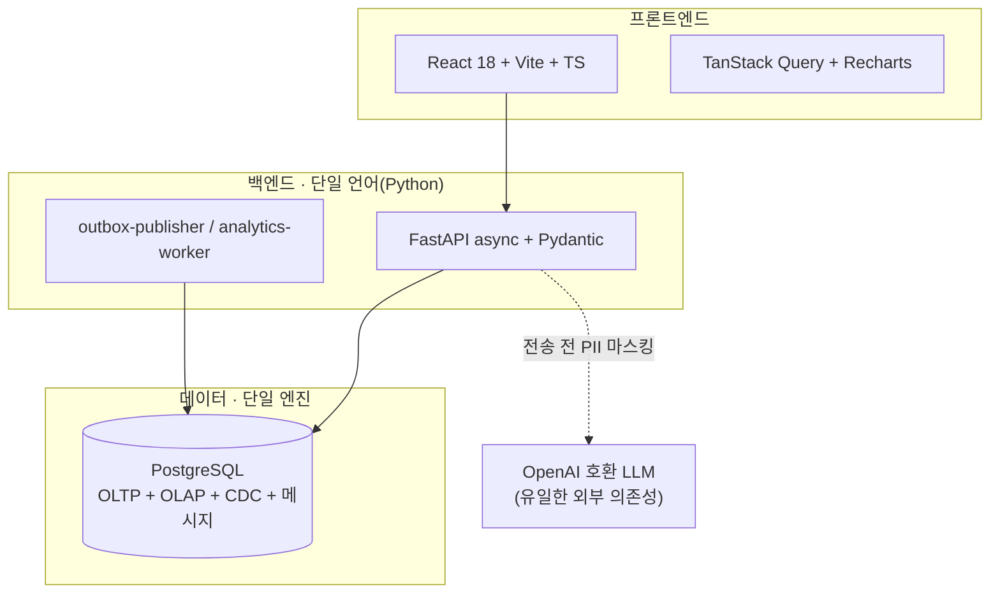
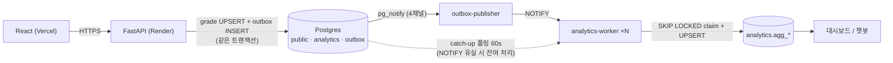
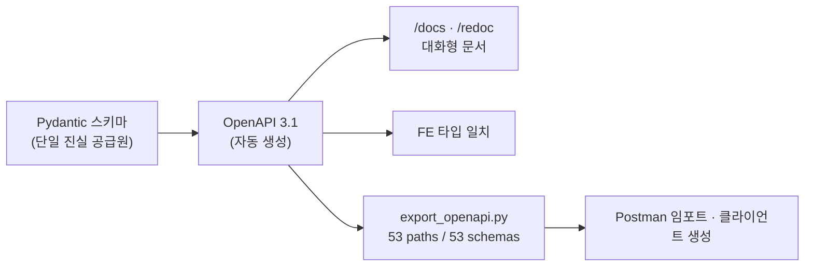
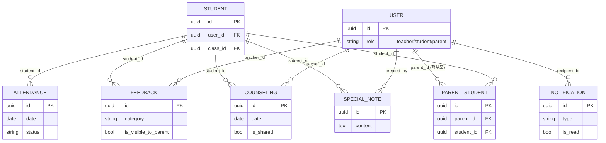
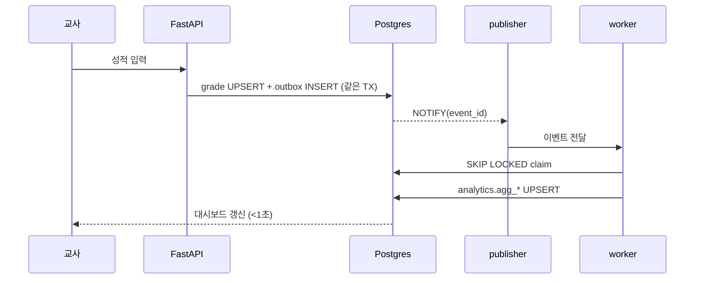
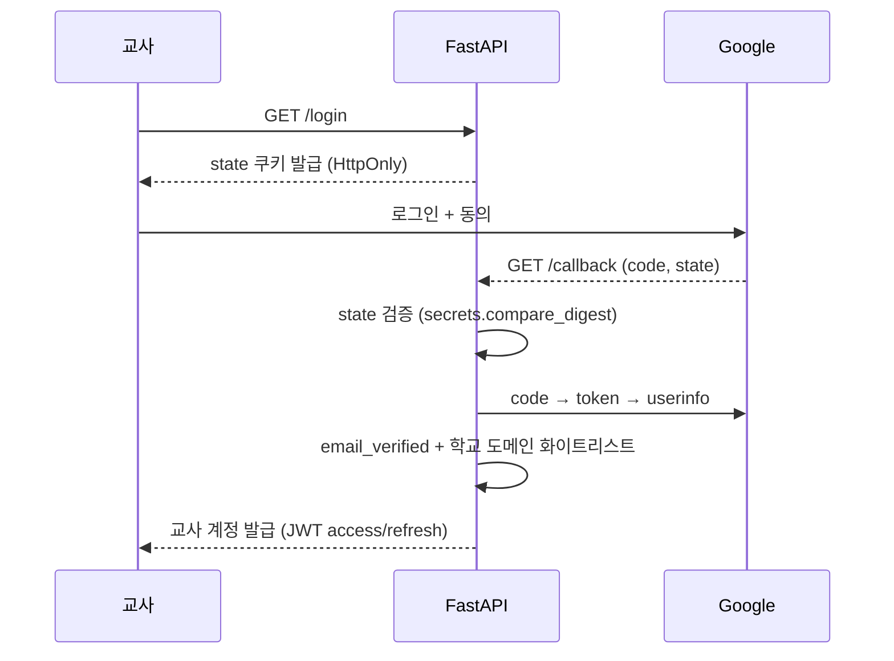
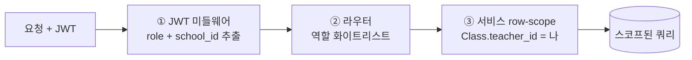
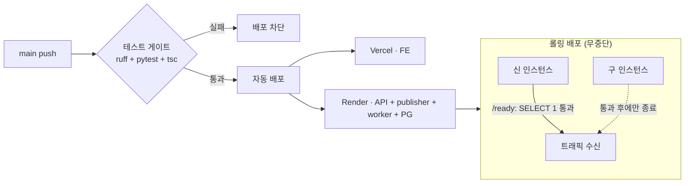
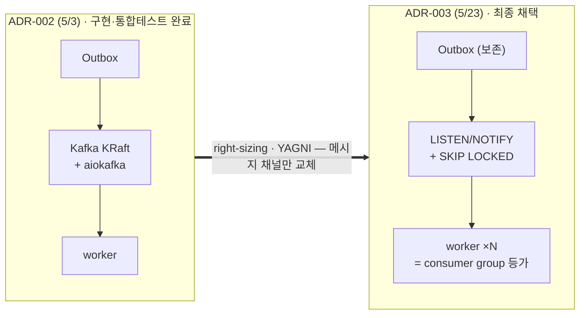
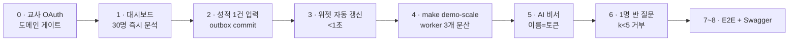

# 발표 아웃라인 — Student Manager

**연관**: Architecture v1.3 / Design Spec v2.3 / ADR-002·003
**구성**: 발표 15분 + 라이브 시연 10분
**관통 메시지**: 좋은 설계는 *최신* 기술이 아니라 **문제 규모에 맞는** 기술을 고르는 것 — 도메인 규모(학교당 ~500명·성적 ~30k row, 분석은 학급 30명 단위)에 맞춘 **right-sizing**.

> 깊은 근거는 `docs/architecture.md`(v1.3)·`docs/design-spec.md`(v2.3)·`docs/decisions/002·003`을 Q&A 백업으로 둔다.

**발표 순서**: ①기술스택 → ②아키텍처+확장성 → ③API/Swagger → ④UML/ERD → ⑤인증 → ⑦배포/CICD → ⑧문제와 해결(Kafka→NOTIFY) → ⑨데모

---

## 0. 도입 (30초)

- **문제**: 교사가 성적·피드백·상담·알림을 4개 분산 도구(엑셀/문서/카톡/지필)로 관리 → 학생 1명 분석에 8~12분. 학부모는 학기 종료 전 접근 불가.
- **솔루션 한 줄**: SaaS형 학생 관리 + 이벤트 기반 실시간 분석 + PII-안전 AI 비서.
- **규모를 먼저 못박는다**(이후 모든 결정의 근거): 고QPS·대용량 스트리밍 도메인이 *아니다*.

---

## 1. 기술 스택 선택 & 이유 (2분)

| 계층 | 선택 | 대안 | **왜** |
|------|------|------|--------|
| FE | **React 18 + Vite + TS** | Next.js | 교사 대시보드라 SSR/SEO 불필요 → Next 오버헤드 회피 |
| FE 상태/시각화 | TanStack Query + Recharts | Redux | 서버/클라이언트 상태 분리, 캐싱·재검증 자동 |
| API | **FastAPI (async)** | Django/Flask | async I/O + Pydantic 검증 + 자동 OpenAPI + 단일 언어로 worker까지 |
| DB | **PostgreSQL 단일** | PG + 별도 OLAP/broker | OLTP+OLAP+CDC+메시지 backplane을 한 엔진에 → 인프라 최소화 |
| 드라이버 | **asyncpg** (Alembic만 psycopg2) | psycopg2 | LISTEN/NOTIFY 네이티브 + async |
| CDC/메시지 | **Outbox + LISTEN/NOTIFY + SKIP LOCKED** | Kafka | 규모에 broker는 over-engineered (→ §8) |
| 인증 | **JWT (access=메모리/refresh=HttpOnly)** | localStorage | XSS 노출 방지 |
| LLM | **OpenAI 호환 SDK 단일** | provider별 SDK | `LLM_BASE_URL`만 교체 + 전송 전 PII 마스킹 |

> **관통 원칙**: 컴포넌트 수를 늘리지 않는다 — 새 인프라마다 secret·모니터링·장애 표면 증가 → 규모가 정당화할 때까지 보류(YAGNI).

🖼️ **추천 도식 — 계층 스택도**: FE / BE(단일 언어) / 데이터(단일 엔진) 3계층. 외부 의존성이 LLM 1곳뿐임을 시각적으로 강조.


---

## 2. 아키텍처 설계 + 확장성 (3분)

```
[Vercel/React] ──HTTPS──▶ [FastAPI (Render Web)] ──INSERT public.outbox (운영과 같은 TX)──┐
                                                                                          ▼
                          [Postgres]  ← OLTP(public) + OLAP(analytics) + CDC(outbox) + 메시지 backplane
                             │ pg_notify(4 ch)            ▲ SKIP LOCKED claim + UPSERT
                             ▼                            │
                  [outbox-publisher] ──NOTIFY──▶ [analytics-worker ×N] ──▶ [analytics.agg_*] ──▶ 대시보드/챗봇
                                              (모두 LISTEN, SKIP LOCKED로 정확히 1개만 처리)
```

- **3계층 + 단일 Postgres가 메시지 브로커까지 겸함**. 외부 의존성은 LLM provider 1곳뿐.
- **핵심 일관성**: 운영 변경(grade UPSERT)과 `outbox` INSERT가 **같은 트랜잭션** → publisher 다운/NOTIFY 유실에도 **이벤트 유실 0**. 유실 시 worker catch-up 폴링(60s)이 잔여분 자동 처리.
- **운영/분석 스키마 분리**: 같은 PG 안 `public`/`analytics` 스키마 구분 + CDC로 OLTP/OLAP 워크로드 분리 (평가 기준 "동일 DB 내 스키마 구분 가능" 충족).

**확장성 & 병목 (정직하게)**
- **수평 확장**: `--scale analytics-worker=3` — N 워커가 동일 NOTIFY를 받아도 SKIP LOCKED로 1개만 처리 = **Kafka consumer group 등가** (Sidekiq·oban 패턴). → §9 라이브 로그.
- **단일 병목**: Postgres 단일 인스턴스가 OLTP+OLAP+outbox+NOTIFY 공존. 평가 규모(수천 row)에선 무시 가능, 평가 후 read replica/외부 broker (Architecture §5·§6).

🖼️ **추천 도식 — 이벤트 흐름도(위 ASCII의 렌더 버전)**: "같은 TX" 경계와 catch-up 폴링 점선이 핵심. 이벤트 유실 0을 한눈에.


---

## 3. API 명세 & Swagger (1분)

- **계약 우선**: Pydantic 스키마 = 단일 진실 공급원 → **Swagger 자동생성** → FE 타입 일치.
- FastAPI OpenAPI 3.1 + `tags_metadata`(14 그룹 설명)·license·contact. 대화형 문서 `/docs`(Swagger)·`/redoc`.
- `scripts/export_openapi.py` → `docs/api/openapi.json` (**53 paths / 53 schemas**) — Postman 임포트·클라이언트 생성용.
- 에러 계약: 모든 비즈니스 에러는 `{ detail, code }` (AppException) — `code`는 머신 판독용.
- **슬라이드**: 라이브 `/docs` 1컷. (Architecture §4.6)

🖼️ **추천 도식 — 계약 우선 파이프라인**: 하나의 Pydantic 스키마가 문서·클라이언트·FE 타입으로 갈라져 나가는 단방향 흐름.


---

## 4. UML / ERD (1.5분)

- **유스케이스**: 교사(성적·상담·피드백·분석) / 학생(본인 조회) / 학부모(자녀 조회) — 3역할.
- **시퀀스 (핵심 1개)**: 성적 입력 → outbox(같은 TX) → publisher NOTIFY → worker SKIP LOCKED → analytics UPSERT. (인증 시퀀스는 축약)
- **ERD 핵심**: School → User·Class → Student → Grade. Grade는 Subject·Semester·작성자(User)와도 연결되고, 학부모는 ParentStudent 조인 테이블로 학생과 다대다. 멀티테넌트 격리는 `school_id`가 **`users`·`classes` 두 테이블에만** 존재하고, 나머지(Student/Grade/Feedback…)는 FK 체인으로 전이 격리(`Class.school_id = 내 학교`). (Design Spec §2)
- **용어 정밀화**: User/Student 분리 = 3정규형이 아니라 **역할별 서브타입 분리**(NULL 방지). 삭제 정책은 soft-delete(`is_active`/보존) 기준으로 통일.

> 가독성을 위해 ERD를 **2장으로 분할** — ① 학사(성적) 핵심, ② 학생 기록·관계자. (실제 SQLAlchemy 모델 `backend/app/models/` 반영)

🖼️ **추천 도식 1 — ERD ① 학사(성적) 핵심**: School을 루트로 user_id(학생 서브타입)·teacher_id(담임) 분기, Grade가 Student·Subject·Semester를 모두 참조하는 구조.
```mermaid
erDiagram
  SCHOOL   ||--o{ USER     : "school_id"
  SCHOOL   ||--o{ CLASS    : "school_id"
  USER     ||--o| STUDENT  : "user_id (학생 계정)"
  USER     ||--o{ CLASS    : "teacher_id (담임)"
  CLASS    ||--o{ STUDENT  : "class_id"
  CLASS    ||--o{ SUBJECT  : "class_id"
  STUDENT  ||--o{ GRADE    : "student_id"
  SUBJECT  ||--o{ GRADE    : "subject_id"
  SEMESTER ||--o{ GRADE    : "semester_id"
  USER     ||--o{ GRADE    : "created_by"

  SCHOOL {
    uuid id PK
    string name
  }
  USER {
    uuid id PK
    uuid school_id FK
    string role "teacher/student/parent"
  }
  CLASS {
    uuid id PK
    uuid school_id FK
    uuid teacher_id FK
  }
  STUDENT {
    uuid id PK
    uuid user_id FK
    uuid class_id FK
    int student_number
  }
  SUBJECT {
    uuid id PK
    uuid class_id FK
    string name
  }
  SEMESTER {
    uuid id PK
    int year
    int term
  }
  GRADE {
    uuid id PK
    uuid student_id FK
    uuid subject_id FK
    uuid semester_id FK
    numeric score
  }
```

🖼️ **추천 도식 2 — ERD ② 학생 기록 · 관계자**: Student를 중심으로 출결·피드백·상담·특기사항이 매달리고, 교사(teacher_id)와 학부모(ParentStudent 다대다)가 붙는 구조.


🖼️ **추천 도식 3 — 핵심 시퀀스(성적 입력 → 분석 갱신)**: §2 흐름을 시간축으로. "같은 TX"와 "<1초 갱신"이 메시지.


---

## 5. 인증 — 학생 / 교사 (1.5분)

- **세션 전략**: JWT access(메모리/Zustand) + refresh(HttpOnly·SameSite=Strict 쿠키). access 1h / refresh 7d.
- **RBAC 3계층**: JWT 미들웨어(role+school_id 추출) → 라우터 역할 화이트리스트 → 서비스 row-level scope(`Class.teacher_id = 나`).
- **계정 발급 (중간발표 최대 문제 → 완결)**:
  - **학생·학부모 = 초대 링크** 가입 (`pending_invite`, 서버가 비밀번호 고정 주입 안 함).
  - **교사 = Google OAuth + 학교 도메인 화이트리스트** — `login`(state 쿠키 발급) → Google 동의 → `callback`(state 검증→token→userinfo→`email_verified`→도메인 게이트→교사 발급).
- **OAuth 보안 강점 2가지** (자동 보안리뷰로 발견·수정):
  - state **CSRF 방어**: HttpOnly 쿠키 바인딩 + `secrets.compare_digest` → 불일치 400 `AUTH_OAUTH_STATE_MISMATCH`.
  - stub **우회 차단**: production에서 stub 호출 시 503 `AUTH_OAUTH_NOT_CONFIGURED`.
- **데이터 보호**: bcrypt(cost≥12), 학생 PII 로그 masking, LLM엔 토큰(`학생A`)+k≥5 익명성. (Architecture §4.5·§7)

🖼️ **추천 도식 1 — 교사 OAuth 시퀀스**: state 쿠키 바인딩 → 도메인 게이트까지. CSRF 방어 지점을 화살표로 짚기.


🖼️ **추천 도식 2 — RBAC 3계층 게이트**: 요청이 세 관문을 통과해야 데이터에 닿는 구조. "every query" 강조.


---

## 7. 배포 & CI/CD 파이프라인 (2분)

**Two surfaces** — 클라우드(외부 demo) + 로컬(분산 시연), 동일 코드·토폴로지·마이그레이션, 분기는 환경변수뿐.

| 환경 | 용도 | 컴포넌트 |
|------|------|---------|
| cloud (Vercel+Render) | 외부 라이브 URL | Vercel(FE) + Render(API + publisher + worker) + Render Postgres |
| local (docker-compose) | `--scale analytics-worker=3` 분산 시연 | 동등 토폴로지 + 시드 |

- **CI/CD**: `.github/workflows/{ci,cd,e2e}.yml` — main push → 테스트 게이트 → Render/Vercel 자동 배포 (GitOps 단순형).
- **무중단 배포**: liveness(`/health`, 프로세스 생존) ≠ readiness(`/ready`, `SELECT 1`→503 `DB_NOT_READY`) **분리**. 롤링 시 신 인스턴스 `/ready` 통과 후에만 트래픽 수신 → 가용 용량 0 구간 없음. Render는 `healthCheckPath`, 예시 K8s(`deploy/k8s/`, `maxUnavailable=0`+probe)는 동일 의미론.
- **K8s 재프레이밍**(교수 심기 관리): "K8s·Argo·무중단은 대규모 표준. 핵심 개념(헬스체크 무중단·선언적 배포·수평확장)은 충족했고, 풀 클러스터는 사용자 0명 환경에 과한 비용이라 **의도적 제외** — 도입 트리거는 §10·ADR에 명시." → 부정이 아니라 **등가+트레이드오프**.
- **왜 Render+Vercel?** LISTEN worker는 영속 연결 필요 → 순수 서버리스 부적합. web+worker+managed PG를 `render.yaml` 하나로 선언. **왜 AWS 아닌가?** 이 규모에 ECS+RDS+ALB+NAT GW는 비용·운영 과중.
- **운영 현실 메모**: Render free Postgres는 생성 30일 후 만료 → 라이브 유지 시 유료 전환 필요. (`docs/notes/zero-downtime-deployment.md`)

🖼️ **추천 도식 — CI/CD 파이프라인 + 무중단 게이트**: push→게이트→배포 본류에, readiness 통과 후에만 트래픽이 붙는 서브그래프를 곁들여 "가용 용량 0 구간 없음"을 시각화.


---

## 8. 맞닥뜨린 문제와 해결: Kafka → LISTEN/NOTIFY (2.5분) ★ 발표 하이라이트

**1차 결정 — ADR-002 (5/3)**: Outbox + Kafka KRaft + aiokafka. rubric "Kafka 같은 메시지 스트림" 가점 + 유실 방어. **구현·통합테스트까지 완료**.

**재평가 — ADR-003 (5/23)**:
1. rubric 재해석 — 가점 대상은 *"event-driven 분석 갱신 구조"*, Kafka는 예시일 뿐.
2. 규모 부정합 — 30k row에 partition·consumer group·broker cluster·schema registry는 가치 없음.
3. 클라우드 배포 — managed Kafka는 secret·SASL·비용 추가.

**2차 결정**: Outbox 유지 + Kafka 제거 + **LISTEN/NOTIFY + SKIP LOCKED**.
- **SKIP LOCKED = consumer group 등가**. 변경 범위는 *메시지 채널뿐* — outbox·멱등성·catch-up·dead-letter는 보존.

**단점 & 완화** (장점만 나열하면 신뢰 하락)
| 단점 | 완화 |
|------|------|
| NOTIFY 휘발성(유실 가능) | outbox에 남아 catch-up 폴링(60s)이 처리 → 정합성 영향 0 |
| NOTIFY payload 8KB 한도 | `{event_id}`만 전송, 본문은 worker가 SELECT |

> **메타 교훈**: 결정을 **번복하고 그 근거를 ADR로 남긴 것** 자체가 핵심 — right-sizing · YAGNI · 되돌릴 수 있는 결정의 가치. (이 서사는 Jira 스프린트 위 백로그 재계획으로도 추적 — `docs/notes/agile-jira-presentation.md`)

🖼️ **추천 도식 — ADR-002 → ADR-003 전환도**: 두 버전을 나란히 두고 "Outbox는 보존, 메시지 채널만 교체"를 색으로 구분. 발표 하이라이트 슬라이드.


---

## 9. 데모 시연 (10분)

자세한 순서는 `docs/notes/demo-rehearsal-checklist.md`.

| # | 시연 | 강조 |
|---|------|------|
| 0 | 교사 Google OAuth 로그인 | 도메인 화이트리스트 → 교사 발급, 비허용 차단 1컷 |
| 1 | 로그인 → 대시보드 | 30명 학급 평균/분포 즉시 |
| 2 | 성적 1건 입력 | Outbox commit (운영과 같은 TX) |
| 3 | 분석 위젯 자동 갱신 | < 1초 (REQ-074) |
| 4 | `make demo-scale` | worker 3개 SKIP LOCKED 분산 로그 |
| 5 | AI 비서 "이 반 영어 평균은?" | 학생명은 토큰으로만 |
| 6 | 1명 반에서 같은 질문 | k<5 거부 |
| 7 | E2E 1개 라이브 | `playwright test landing-login-grade` |
| 8 | Swagger `/docs` | 계약 우선 1컷 |

🖼️ **추천 도식 — 데모 시연 플로우**: 8단계를 한 줄 타임라인으로. 발표자·청중이 "지금 몇 번째"인지 따라오게 하는 내비게이션 슬라이드.


**다음 단계**: 학부모 모바일 알림(FCM) · OCR 자동채점 · LLM 응답 캐시 · (인프라) 확장 트리거 시 read replica/외부 broker (Architecture §10).

---

## 부록 A. 예상 Q&A (ADR Risks가 곧 대본)

| 질문 | 답변 |
|------|------|
| 왜 Kafka를 안 썼나? | 도메인 규모. 30k row에 broker cluster·partition은 의미 없음 |
| LISTEN/NOTIFY가 메시지 스트림인가? | Postgres 내장 pub/sub. Sidekiq·oban이 SKIP LOCKED로 동작 |
| 알림이 유실되면? | outbox에 남아 catch-up 폴링(60s)이 처리 → 정합성 영향 0 |
| scale 보장? | N 워커가 같은 NOTIFY를 받아도 SKIP LOCKED로 1개만 = consumer group 등가 |
| 왜 처음부터 NOTIFY를 안 했나? | rubric상 Kafka가 안전해 보였다 → 재해석 후 'event-driven 구조'가 핵심임을 확인, 규모 보고 전환 |
| 왜 AWS가 아니라 Render? | right-sizing. ECS+RDS+NAT GW는 과중, worker 영속 연결로 순수 서버리스도 부적합 |
| 운영/분석 DB를 왜 물리 분리 안 했나? | 동일 DB 내 스키마 분리 허용 + CDC로 워크로드 분리. 물리 분리는 규모가 정당화할 때 |
| K8s/Argo를 왜 안 썼나? | 핵심 개념 충족(readiness 무중단·GitOps·SKIP LOCKED). 풀 클러스터는 과한 비용 → 의도적 제외 |
| 무중단 배포 보장? | liveness/readiness 분리. 신 인스턴스 `/ready` 통과 후 트래픽, DB 끊김 시 재시작 아닌 제외 |
| 테스트 충분한가? | 3계층: 단위 200/81% + 통합 testcontainers + E2E 11. 각 계층이 다른 실패를 잡음 |
| OAuth state 검증(CSRF)? | state를 HttpOnly 쿠키에 바인딩 후 `compare_digest`. 불일치 400, stub은 prod에서 503 |

---

## 부록 B. AI 비서 한 문장의 내부 흐름 — "이번 학기 2반의 평균 영어 점수를 알려줘"

> 질문 한 문장이 백엔드에서 어떻게 처리되는지 step-by-step. 코드: `chatStore.ts` → `routers/chat.py` → `services/{chat_intent,chat_context,llm_client}.py`.

1. **FE 호출**: `chatStore`가 `POST /api/v1/chat` 호출. body `{ message: "이번 학기 2반의 평균 영어 점수를 알려줘", thread_id? }`, 헤더에 access_token(메모리) Bearer.
2. **레이트리밋**: `@limiter.limit("10/minute", key_func=user_id_key)` — 교사당 분당 10회 초과 시 429.
3. **인증·RBAC**: `require_role("teacher")` 의존성이 JWT를 풀어 `user(id, role, school_id)` 주입. 교사가 아니면 403.
4. **의도 분류 (룰 기반, `resolve_semester_id`)**: 학기 목록을 `year DESC, term DESC`로 정렬 → 메시지에 **"이번"** 키워드 → 최신 학기 `semester_id` 선택. LLM tool calling 없이 비용·지연 0. ("2반"·"영어"는 여기서 파싱하지 않음 — 7번 참고.)
5. **컨텍스트 조회 (`fetch_student_rows`)**: `WHERE Class.teacher_id = 나 AND User.school_id = 내 학교` — **담임 학급 학생만**. 학생 N명을 **전체 집계 1쿼리 + 과목별 집계 1쿼리 = 2쿼리**로 끝내 N+1 회피. 각 행 = `{ student_name, student_number, class_name, overall, subjects[과목명·평균·표본수] }`.
6. **system prompt 구성**: 분석 지시문 + `[학급 통계]` JSON 직렬화를 system 메시지로, 교사 원문 질문을 user 메시지로.
7. **LLM 호출 (`llm.complete`)**: OpenAI 호환 엔드포인트, timeout 10s / max_tokens 1024. **핵심**: "2반"·"영어" 필터링은 백엔드가 아니라 **LLM이 통계 JSON에서 추출** — `class_name == "2반"` 행들의 `subjects` 중 "영어" 평균을 골라 답한다.
8. **응답 후처리**: 응답에서 학생 토큰을 스캔해 `referenced_students[]` 구성. **이번처럼 학급 평균(집계) 질문이면 개별 학생 지목이 없어 `referenced_students = []`** → "2반 영어 평균은 78.5점입니다" 형태의 숫자 답만.
9. **반환·렌더**: `ChatResponse { thread_id, reply, referenced_students }` → FE 말풍선 렌더.

**실패 분기**: OpenAI 타임아웃 → 504 `CHAT_TIMEOUT` / 업스트림 오류 → 502 `CHAT_UPSTREAM_ERROR` / 키 없음 → `StubLlmClient` 폴백.

**발표 포인트**: 의도 분류는 룰(학기)로 비용 0, 데이터 접근은 **담임 학급으로 스코프 한정**, 집계는 2쿼리로 N+1 회피. 별도 AI 마이크로서비스 없이 FastAPI 단일 엔드포인트 = right-sizing.
